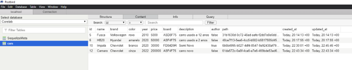
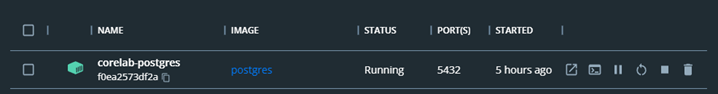

<h1>Corelab challenge</h1>

Database Interface

Docker

<h2>project's goal</h2> 

The main goal of the project is the CRUD of the vehicles. Create/Read/Update/Delete

<h2>Project Description</h2>

<ul>

<li>I used an API that I produced myself that allows you to create, update, view, and delete the car's information.</li>

<li>The method used to produce the API is MVC (Model-View-Controller), facilitating the exchange of information between the database and the user interface.</li>

<li>The API used the PostgreSQL database manager with Sequelize and migrations in conjunction with Docker.</li>

<li>Yup was used in the API for data validation.</li>

<li>Use of Prettier and Eslint for standardization and code organization.</li>

<li>Multer was used to insert image into Api.</li>

</ul>

<h2>project features</h2> 

<ul>

<li>When you click the "Add New Vehicle" button, a new form opens to create a vehicle.</li>

<li>When you submit the form, the new vehicle is saved. </li>

<li>By typing something into the Search Input, the vehicles are filtered by comparing whatever the ownership of the vehicle is. For example: the search term is compared with the name, or the description, or the price, or any other field of the vehicle.</li>

<li>By clicking on a heart icon, the vehicle is favorited. </li>

<li>Clicking an edit icon opens the form for the selected vehicle again to edit it.</li>

<li>Clicking a delete button removes the vehicle. </li>

<li>Clicking on the filter button opens a filter form, and when the filters are selected, it filters the vehicles based on the values. </li>

<li>The cards are background color based on the color of the vehicle (e.g. white vehicle, card is white).</li>

<li>It is also possible to place or change an image of the vehicle when creating and editing the car.</li>

</ul>

<h2>🤝 Collaborator </h2> 
<table>
  <tr>
    <td align="center">
      <a href="#">
      
       
        
          <b>Diogo Luis</b>
        
      </a>
    </td>
  </tr>
</table>

<h2> 👨‍💻 Technologies </h2>

Technologies used in this project:

 

